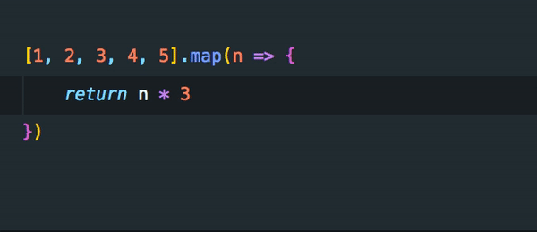
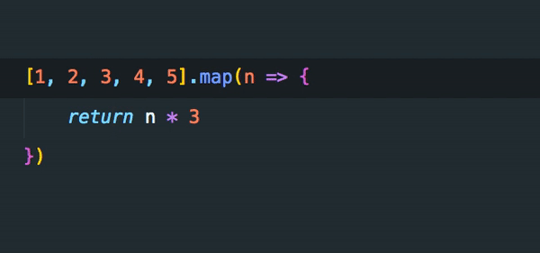
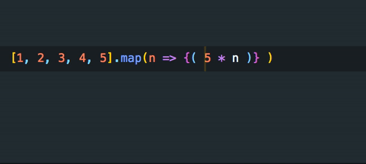
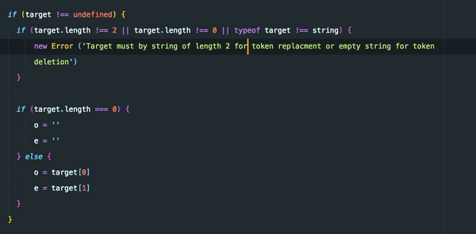
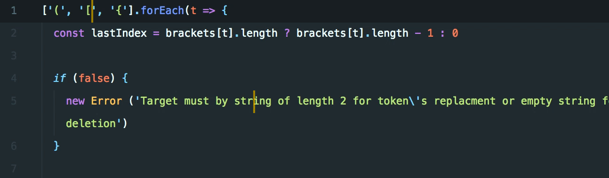
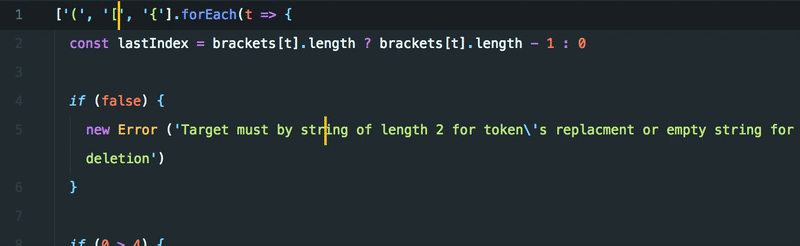
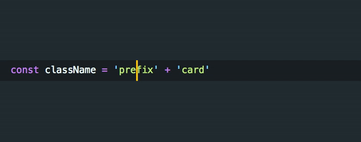
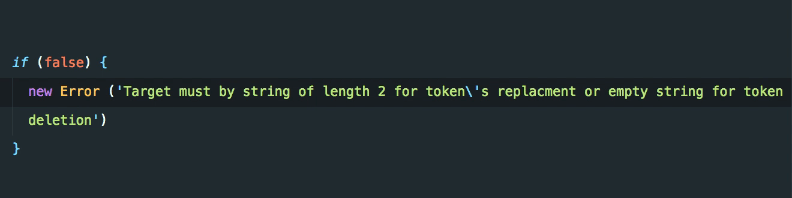

# Bracketeer

**‼️ IMPORTANT INFO**

**Unfortunately due to family reasons, I don't have time to maintain the extension and react to all the feedback in some reasonable time. The extension is stable and working, but there are bugs and edge cases I would like to address. If you want to help me with it, feel free to contact me. I don't plan to scratch the extension as I use it a lot myself. But I don't have the resources to move it forward and fix the bugs.**

**Thanks for understanding**

---

Bracketeer gives you brackets and quotes superpowers at the tip of your fingers. Easily swap bracket/quote types, remove them or select their content from within with one command. No need to select content of the bracket/quote or move your cursor. Works even on multiple selections.

Extension should work with different languages, but if you encounter error, please let know and I will try to fix it.

Feedback and PRs are welcome. Enjoy the plugin.

## Features

Bracketeer currently provide four commands to manipulate with brackets and their equivalents for quotes. All commands work on multiple selections as well.

### Brackets

#### Swap brackets/Replace brackets with...

_Swap brackets_: `Shift+Cmd+Alt+K`
_Replace brackets with..._: `Shift+Cmd+Alt+U`

This command allows you to switch to different bracket types from within the brackets without need to select them. You can either cycle through them or use Quick pick menu to select correct bracket immediately.

#### Remove brackets

Keyboard shortcut: `Shift+Cmd+Alt+I`

This command will delete closest brackets

#### Select brackets content

Keyboard shortcut: `Shift+Cmd+Alt+H`

With the help of this command you can easily select content of the brackets, Calling this command again will select brackets as well. This can be chained to select outer brackets (and perform some actions on them).

### Quotes

#### Swap quotes/Replace quotes with...

_Swap quotes_: `Shift+Cmd+Alt+;`
_Replace quotes with..._: not assigned by default

This command allows you to switch to different quote types from within the quotes without need to select them. You can either cycle through them or use Quick pick menu to select correct quote type immediately.

#### Remove quotes

Keyboard shortcut: `Shift+Cmd+Alt+'`

This command will delete enclosing quotes

#### Select quotes content

Keyboard shortcut: `Shift+Cmd+Alt+0`

With the help of this command you can easily select content of the quotes, Calling this command again will select quotes as well. Unlike bracket alternative, selection won't expand more after selection of the quotes.

## How does it work

Since VS Code does not provide extension API for working with language (grammar) tokens. In order to make this extension I'm using [Prism.js](https://prismjs.com/) to parse the documents. This has some edge cases but mostly work pretty well. This extension have `language-definitions.json` file which contains brackets/quotes sets for given language and token types used to identify brackets/quotes in text (by Prism). For more detail have a look into source code. This file contains only small set of languages I'm using. If there is not language definition for your language of choice extension will default to JS (it works... usually).

If your language of choice is missing in definitions file and you would like to contribute please feel free to submit a PR. But test first that it is working, I will test it myself as well before merging.

### Known Issues

- HTML tokens parsed by Prism have nested tokens inside of them. Bracketeer can't handle it at the moment. So do not expect it to work here.
- In case of switching quotes from multiline template literal to simple string the result will be invalid string (especially with variable interpolation). So the next quotes switching won't work and Bracketeer will fail. There is not an easy way how to fix it. So please keep that in mind.
- When parsing quotes there may be some edge cases in string heavy documents with long multiline string when wrong quotes will be parsed. I plan to look into it and find a way how to minimize or remove this issue.

## Road map

In no particular order:

- Selection from cursor to opening/closing bracket/quote
- Tests - yeah, don't have one yet (shame). And current refactoring was a hell sometimes. Seriously people write tests.
- Cursor navigation to opening/closing brackets/quotes
- Migrate to TS (once we have test)
- Support for HTML (not working now)
- Make it work in comments as well (I have some idea, just need to experimetn a bit)
- Add settings to specify how large line offset should be used for quotes parsing (default is 8)

## Release Notes

See [changelog](CHANGELOG.md)

## License

MIT
